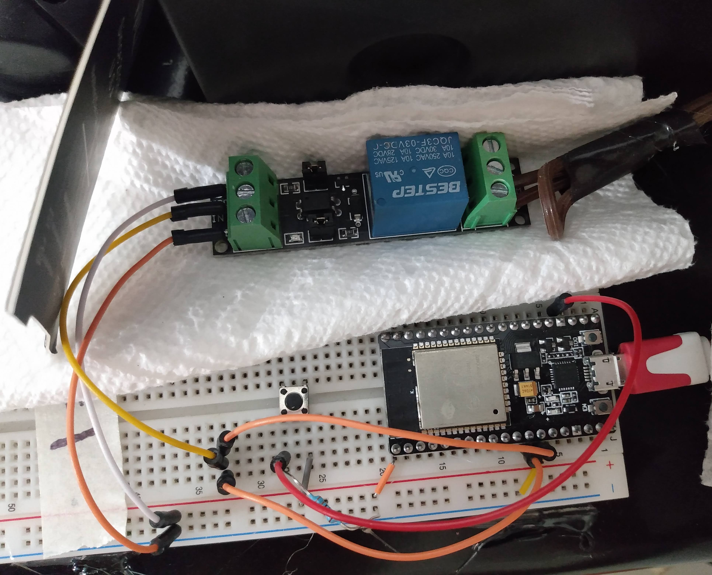
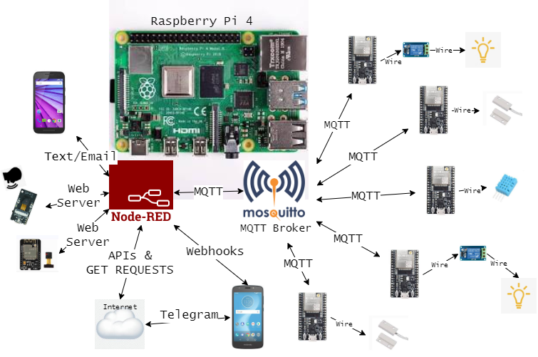
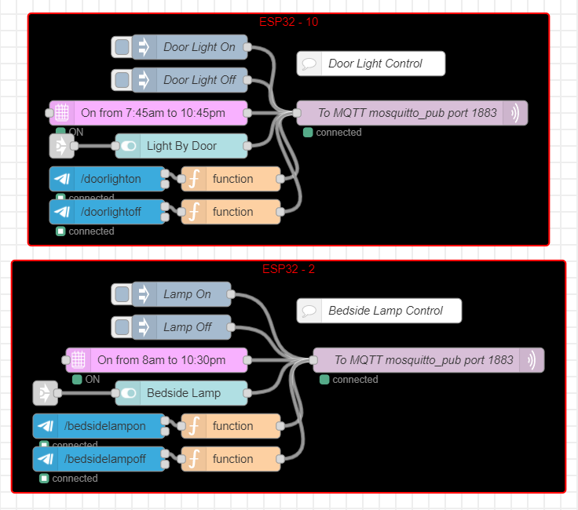
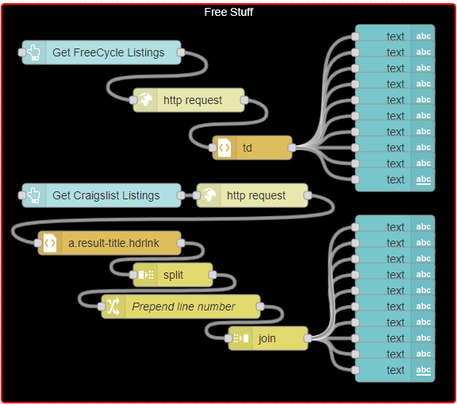
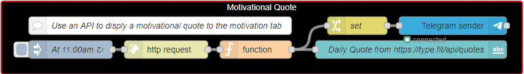
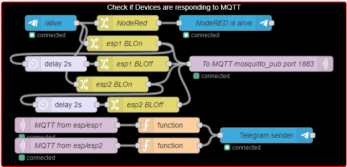
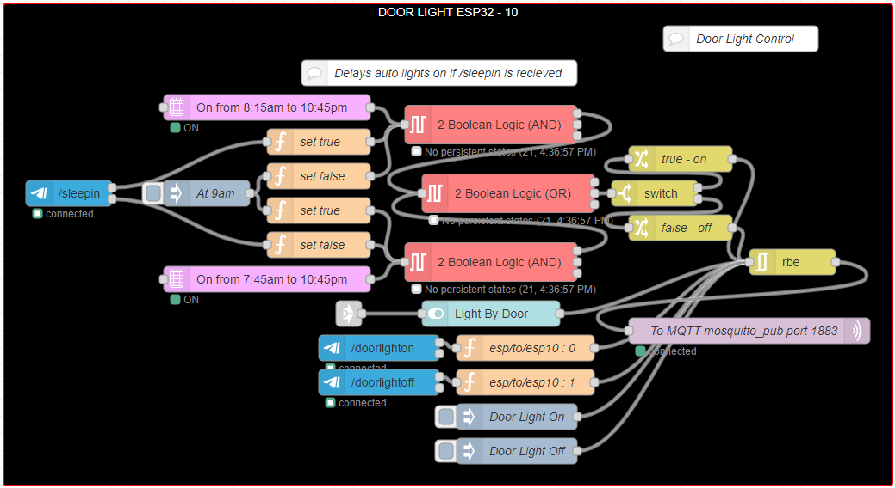
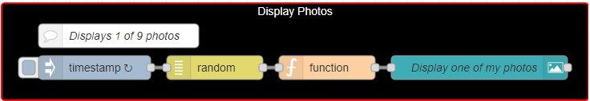
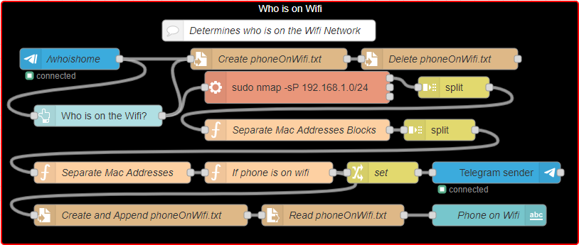

# Home-Automation-NodeRED-ESP-Telegram
<!-- PROJECT SHIELDS -->
<!--[![Contributors][contributors-shield]][contributors-url]-->
<!--[![Forks][forks-shield]][forks-url]-->
<!--[![MIT License][license-shield]][license-url]-->
<!---->
[![LinkedIn][linkedin-shield]][linkedin-url]
[![Stargazers][stars-shield]][stars-url]
[![Features][issues-shield]][issues-url]

[](https://github.com/Alextros00/Home-Automation-NodeRED-ESP-Telegram)

<!-- PROJECT LOGO -->
<br />
<p align="center">
  <a href="https://github.com/Alextros00/Home-Automation-NodeRED-ESP-Telegram">
    
  </a>

  <h3 align="center">Home Automation</h3>

  <p align="center">
    A cheap way to automate anything and everything!
    <br />
    <a href="https://github.com/Alextros00/Home-Automation-NodeRED-ESP-Telegram"><strong>Explore the docs »</strong></a>
    <br />
    <a href="https://github.com/Alextros00/Home-Automation-NodeRED-ESP-Telegram">View Demo</a>
    ·
    <a href="https://github.com/Alextros00/Home-Automation-NodeRED-ESP-Telegram/issues">Report Bug</a>
    ·
    <a href="https://github.com/Alextros00/Home-Automation-NodeRED-ESP-Telegram/issues">Request Feature</a>
    <br />
    <a href="https://www.buymeacoffee.com/AlexTrostle" target="_blank"></a>
  </p>
</p>

<!-- TABLE OF CONTENTS -->

<details open="open">
  <summary>Table of Contents</summary>
  <ol>
    <li>
      <a href="#about-the-project">About The Project</a>
      <ul>
	<li><a href="#built-with">Built With</a></li>
      </ul>
    </li>
    <li>
      <a href="#getting-started">Getting Started</a>
      <ul>
	<li><a href="#prerequisites">Prerequisites</a></li>
	<li><a href="#mosquitto-mqtt-broker">Mosquitto MQTT</a></li>
	<li><a href="#nodered">NodeRED</a></li>
	<li><a href="#esp32">ESP32</a></li>
	<li><a href="#telegram">Telegram</a></li>
      </ul>
    </li>
    <li><a href="#usage">Usage</a></li>
    <li><a href="#roadmap">Roadmap</a></li>
    <li><a href="#license">License</a></li>
    <li><a href="#contact">Contact</a></li>
    <li><a href="#acknowledgements">Acknowledgements</a></li>
  </ol>
</details>

<!-- ABOUT THE PROJECT -->
## About The Project
This project is about automating all aspects of my home that I can. Why turn on my lights every morning at 7am and turn them off every night at 10:45pm when it can be done for me! I want to spend as little time as possible dealing with repetitive tasks and focusing on the things that matter most to me.
This project consists of many smaller projects. Here is where they are all put together and additional features are added.

### Built With
There were many parts to this project. Some sub-projects that I did in order to build up to this complexity can be found on my [here](https://github.com/Alextros00).

#### Main Components
* [Raspberry Pi 4](https://www.raspberrypi.org/products/raspberry-pi-4-model-b/?resellerType=home&variant=raspberry-pi-4-model-b-8gb). <sup>&dagger;</sup>
  * [MQTT through Mosquitto](https://mosquitto.org/)
  * [NodeRED](https://nodered.org/)
* [ESP32](https://www.espressif.com/en/products/socs/esp32)
* [Telegram](https://telegram.org/)

<sup>&dagger;: I us 8GB but don't really think it is required.</sup>

### Architecture
<p align="center">
  <a href="https://github.com/Alextros00/Home-Automation-NodeRED-ESP-Telegram">
    
  </a>
</p>

<!-- GETTING STARTED -->
## Getting Started
These steps will take you through getting your own project up and running. This will take you through getting getting Mosquitto, NodeRED, and ESP32 to control a light.<br/>


<!-- Prerequisites -->
### Prerequisites
The software used is free and mostly open source. All will be explained here!<br/>
It would help to have the hardware below.
* Laptop
* Smartphone
* At least one [ESP32]()
* [Raspberry Pi 4]() <sup>&dagger;</sup> <sup>&Dagger;</sup> <br/>
<sup>&dagger;: Raspberry Pi 4 should be running [Raspbian Operating System](https://projects.raspberrypi.org/en/projects/noobs-install)</sup><br/>
<sup>&Dagger;: Needs to be connected to and using a 2.4GHz network. This is because the ESP32 currently(Dec 2020) cannot connect to 5GHz networks.</sup><br/>

<!-- ESP32 -->
### ESP32
You can get really cheap knock off ESP32s on [AliExpress](https://www.aliexpress.com/)<br/>
Some ESP devices that I use are: ESP-WROOM-32, ESP-32S, ESP32-CAM, ESP-EYE<br/>
#### Hardware Wiring
Depending on the project specific goal of your ESP32 device depends on how you want to wire it. Here You will be shown how to wire to use your ESP32 to remotly control a light using a relay.

#### ESP-IDF
1. Setup Toolchain for [Windows](https://docs.espressif.com/projects/esp-idf/en/latest/get-started/windows-setup.html), [Linux](https://docs.espressif.com/projects/esp-idf/en/latest/get-started/linux-setup.html) or [Mac OS](https://docs.espressif.com/projects/esp-idf/en/latest/get-started/macos-setup.html). If you use a installer package then you can skip to step 6.<br/>
2.  Get ESP-IDF.
	Besides the toolchain (that contains programs to compile and build the application), you also need ESP32 specific API / libraries.<br/>
  	```cd ~/esp```<br/>
	```git clone --recursive https://github.com/espressif/esp-idf.git```<br/>
3. Setup Path to ESP-IDF.
	The toolchain programs access ESP-IDF using IDF_PATH environment variable.<br/>
	This variable should be set up on your PC, otherwise projects will not build.<br/>
	* [Windows](https://docs.espressif.com/projects/esp-idf/en/latest/get-started/add-idf_path-to-profile.html#add-idf-path-to-profile-windows)
	* [Linux & Mac OS](https://docs.espressif.com/projects/esp-idf/en/latest/get-started/add-idf_path-to-profile.html#add-idf-path-to-profile-linux-macos)
4. Install Required Python Packages.<br/>
   ```python -m pip install --user -r $IDF_PATH/requirements.txt```
5. Export the path<br/>
   ```export IDF_PATH=~/esp/esp-idf```<br/>
   ```export PATH=$PATH:$HOME/esp/xtensa-esp32-elf/bin```<br/>
<sup>&Dagger;:Check the [official site](https://esp-idf.readthedocs.io/en/latest/get-started/index.html) for more info.</sup>
6. Fork my repo and Clone my ESP32 MQTT Light Control repository using the command down below with your user name in place of mine.<br/>
   ```git clone -b --recursive https://github.com/Alextros00/Home-Automation-NodeRED-ESP-Telegram/ESP32```

#### Configuration
1. Plug in your ESP32 to your laptop and open your command line.
2. ```cd``` into the project directory.<br/>
3. Open the configuration menu. It may take a minute to load.<br/>
   ```idf.py menuconfig```
4. Go to ```Serial flasher config```
   	* Set the `Default baud rate` to `115200 baud` for the ESP32
	* Set ```Default serial port``` and set the port in which your ESP32 is connected<sup>&dagger;</sup><sup>&Dagger;</sup>
   <br/><sup>&dagger;:Your serial port can be found using [this guide](https://docs.espressif.com/projects/esp-idf/en/latest/get-started/establish-serial-connection.html).</sup><br/>
<sup>&Dagger;:One problem I had was that it is not clearly documented that if using windows the port should be configured in the COMX for example COM0</sup><br/>
6. Click `Save` -> `Ok` -> `Exit` -> `Exit` to get back to the main configuration screen<br/>
7. Go to `Example Configuration`
	- Set `WiFI SSID` and `WiFi password` to that of your local 2.4GHz network
	- Set `Broker URL` to your mqtt server:port. It will look something like `mqtt://@192.168.1.142:1883` if you have no username and password configured for Mosquitto
	- Enter the `ESP32-X Number` that you are using. This can be left blank and has no impact on the functionality of the code besides messages sent.
	- Enter the `Relay GPIO Number` or the GPIO that will control the relay. What pin you can use can be found on your device specific pinout.
	- Select `enter 1 or 2` to decide between subscribing to 1 or 2 relay. Default is 1.
	- Set the `MQTT Topic to Subscribe To` or recieve messages from
	- Set the `2nd MQTT Topic to Subscribe To`. Can be left alone if not using.
	- Set the `MQTT Topic to Publish To` or send messages to
8. Once done configuring the project exit out of the menu by clicking `Save` -> `Ok` -> `Exit` -> `Exit` -> `Exit` to go back to the terminal

#### Flash and Monitor
Build and flash the project onto your device.<br/>
```idf.py build & flash```<br/>
Monitor the logs of your device<br/>
```idf.py monitor```<br/>
To exit the monitor us `Ctrl + ]` or `Ctrl` and  `]` at the same time

<!-- Mosquitto -->
### Mosquitto MQTT Broker
> MQTT is a machine-to-machine (M2M)/"Internet of Things" connectivity protocol. It was designed as an extremely lightweight publish/subscribe messaging transport. It is useful for connections with remote locations where a small code footprint is required and/or network bandwidth is at a premium [[mqtt.org](http://mqtt.org)]. The Mosquitto broker will be installed on your Raspberry Pi as the broker and your ESP devices will be clients. [Learn more here.](http://www.steves-internet-guide.com/mqtt-works/)

Navigate to the terminal and follow these steps for the installation.
1. Update your Raspberry Pi<br/>
```sudo apt-get update```
2. Install Mosquitto<br/>
```sudo apt-get install mosquitto```
3. Install Mosquitto Client<br/>
```sudo apt-get install mosquitto-clients```
<br/><sup>&Dagger;: Note for later: Port of your Mosquitto Broker, most likely 1883; Server Mosquitto Broker is running on, most likely the ip address of your Raspberry Pi</sup><br/>


<!-- NodeRED -->
### NodeRED
>[NodeRED](http://nodered.org) is a low-code programming tool for wiring together hardware devices, APIs and online services for event driven applications. The browser-based editor that makes it easy to wire together flows using the wide range of nodes in the palette that can be deployed to its runtime in a single-click.

[Install NodeRED on your Raspberry Pi](https://nodered.org/docs/getting-started/local)

#### Flows
Many of the flows used can be found in [my collection at nodered.org](https://flows.nodered.org/collection/RV7rLt9tjepZ). Here only the different funcitonality NodeRED has provided me will be discussed. Details are provided how the specific flow works are on [my NodeRED page](https://flows.nodered.org/user/Alextros00).

##### Functionality
Light Control: lights can be controlled through a Telegram command, a button by the lamp, a button on my NodeRED Dashboard, and a webhook on my phone's home screen
* Light Control: Lights can be controled through time of day, a [Telegram Command using a inline keyboard](https://flows.nodered.org/flow/c8194f9d056455018d2da8ef7e109733), the NodeRED Dashboard, a webhook on my phone homescreen, or even a good old button by the lamp
* Raspberry Pi Status: The Raspberry Pi 4 has been rumored to overheat. I monitor the temperature and recieve notification and text if it goes to high
* Local Free Listings: The dashboard displays local free listings from FreeCycle and Craigslist
* Motivational Dashboard: When idol the dashboard displays a motivational image, quote and Bible verse that rotate regularly. I also recieve a [daily motivational message.]()

##### Flow Gallery
<p float="middle">
  
  
  
  
  
  
  
  
</p>

<!-- Telegram -->
### Telegram
Telegram adds the ability to control the system from your phone but is not required for use. You could stricktly use the NodeRED dashboard to control your system. In this implementation, Telegram does not directly control any devices but rather goes through NodeRED using the [node-red-contrib-telegrambot](https://flows.nodered.org/node/node-red-contrib-telegrambot) library.<br/>
#### Commands
* `/water` 	    - records that I drank a bottle of water
* `/poop` 	    - records that I took a poop
* `/piss` 	    - records that I took a pee
* `/whoishome` 	    - replys with who is on my home wifi
* `/alive` 	    - replys with what devices are responding on the system
* `/lights`	    - displays inline keyboard to choose which light to change and what to do with it
* `/motivation`     - changes the motivational display on the dashboard and sends motivation to Telegram
* `/sleepin`	    - delays the auto turn on of my lights by 30 minutes, twice will do an hour, 3 times no effect
* `/help` 	    - responds with the Telegram ChatId 
#### Notifications
* `Raspberry Pi is over 65 degree C` - Tells me when the Raspberry Pi has reached temperatures over 65C. 

<!-- USAGE EXAMPLES -->
## Usage
The system can be utilized in two ways, through the Telegram-Bot or through the NodeRED Dashboard.<br/>
#### Usage through Telegram
Telegram sends me [notifications](#notifications) and I can send it [commands](#commands).
#### Usage through the NodeRED Dashboard
The NodeRED Dashboard can be used to control the system through buttons, text boxes and switches, but also displays alot of information.<br/>

<!-- ROADMAP -->
## Roadmap
See the [open issues](https://github.com/Alextros00/Home-Automation-NodeRED-ESP-Telegram/issues) for a list of proposed features (and known issues).<br/>
This project will continue to grow in my free time to automate everything... except working out... that you just have to do.

<!-- LICENSE -->
## License
Distributed under the MIT License. See `LICENSE` for more information but basically you can take my code but I would appreciate a coffee!

<!-- CONTACT -->
## Contact
##### Alex Trostle - [GitHub](https://github.com/Alextros00) - [Email](Alextros00@gmail.com) - [LinkedIn](https://www.linkedin.com/in/alex-trostle/) - [Instagram](https://www.instagram.com/alextros0/) <br />
<a href="https://www.buymeacoffee.com/AlexTrostle" target="_blank"></a><br/>

<!-- ACKNOWLEDGEMENTS -->
## Acknowledgements
* [Nice README page to refference and get me started](https://github.com/ETS-PoliTO/esp32-sniffer/edit/master/README.md)

<!--
LINKS USED IN THE CREATION OF THIS PAGE:
* [GitHub Emoji Cheat Sheet](https://www.webpagefx.com/tools/emoji-cheat-sheet)
* [Img Shields](https://shields.io)
* [Choose an Open Source License](https://choosealicense.com)
* [GitHub Pages](https://pages.github.com)
* [Animate.css](https://daneden.github.io/animate.css)
* [Loaders.css](https://connoratherton.com/loaders)
* [Slick Carousel](https://kenwheeler.github.io/slick)
* [Smooth Scroll](https://github.com/cferdinandi/smooth-scroll)
* [Sticky Kit](http://leafo.net/sticky-kit)
* [JVectorMap](http://jvectormap.com)
* [Font Awesome](https://fontawesome.com)
-->

<!-- MARKDOWN LINKS & IMAGES -->
<!-- https://www.markdownguide.org/basic-syntax/#reference-style-links -->
[contributors-shield]: https://img.shields.io/github/contributors/Alextros00/Home-Automation-NodeRED-ESP-Telegram.svg?style=for-the-badge
[contributors-url]: https://github.com/Alextros00/Home-Automation-NodeRED-ESP-Telegram/graphs/contributors
[forks-shield]: https://img.shields.io/github/forks/Alextros00/Home-Automation-NodeRED-ESP-Telegram.svg?style=for-the-badge
[forks-url]: https://github.com/Alextros00/Home-Automation-NodeRED-ESP-Telegram/network/members
[stars-shield]: https://img.shields.io/github/stars/Alextros00/Home-Automation-NodeRED-ESP-Telegram.svg?style=for-the-badge
[stars-url]: https://github.com/Alextros00/Home-Automation-NodeRED-ESP-Telegram/stargazers
[issues-shield]: https://img.shields.io/github/issues/Alextros00/Home-Automation-NodeRED-ESP-Telegram.svg?style=for-the-badge
[issues-url]: https://github.com/Alextros00/Home-Automation-NodeRED-ESP-Telegram/issues
[license-shield]: https://img.shields.io/github/license/Alextros00/Home-Automation-NodeRED-ESP-Telegram.svg?style=for-the-badge
[license-url]: https://github.com/Alextros00/Home-Automation-NodeRED-ESP-Telegram/LICENSE.txt
[linkedin-shield]: https://img.shields.io/badge/-LinkedIn-black.svg?style=for-the-badge&logo=linkedin&colorB=555
[linkedin-url]: https://www.linkedin.com/in/alex-trostle/
